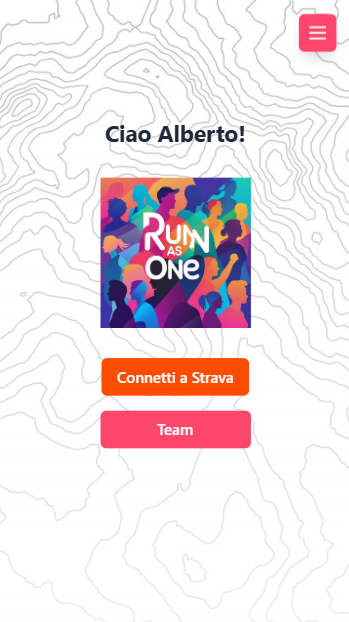
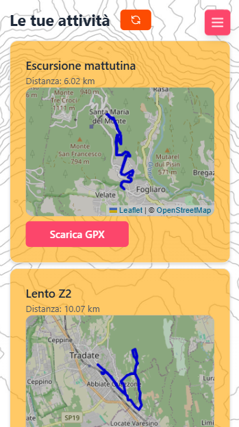
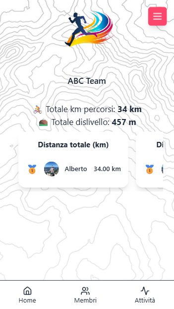
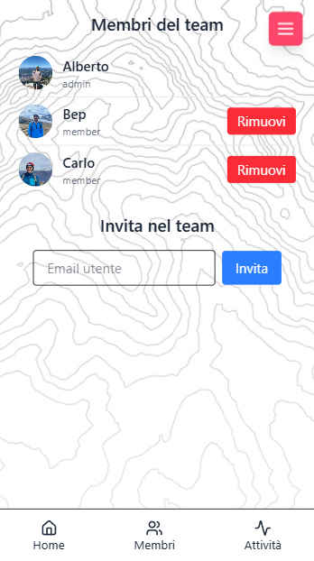

# RunAsOne 🏃‍♂️🚴

**RunAsOne** è un'applicazione web per corridori e ciclisti pensata per "competere" in modo sano con amici e compagni di squadra.  
Crea il tuo team, invita amici, importa percorsi da Strava, e partecipa a sfide condivise!

---

## 🚀 Features

- 🧭 Integrazione con [Strava API](https://www.strava.com/settings/api)
- ⚙️ Backend in **FastAPI**
- 💻 Frontend in **React + TypeScript**
- 🔐 Autenticazione via JWT
- 📍 Visualizzazione percorsi su **Leaflet**
- 🗺️ Decodifica delle polilinee Strava
- ✅ Avvio completo con un solo comando (`npm start`)

## 🖼️ Preview

<div style="display: flex; flex-wrap: wrap; gap: 10px; justify-content: space-between;">
    
    
    
    
</div>

## ⚙️ Setup

### 1. Clona il repository

```bash
git clone https://github.com/albertoperuzzu/RunAsOne.git
cd RunAsOne
```

### 2. Autenticati in STRAVA

Copia il file .env.example e rinominalo .env nella cartella
Per i campi Strava, devi creare una app su https://www.strava.com/settings/api
e inserire i campi nel file!

### 3. Installa dipendenze

```bash
npm install
python -m venv venv
source venv/bin/activate       # su Unix/macOS
venv\Scripts\activate          # su Windows
pip install -r backend/requirements.txt
```

### 4. Avvia BE e FE

```bash
npm start
```

Frontend → http://localhost:5173
API docs (FastAPI) → http://localhost:8000/docs